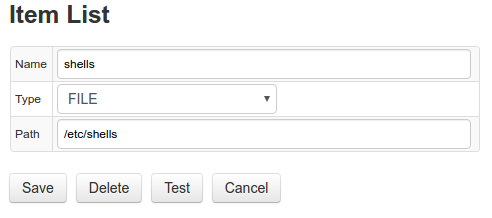

# Collections

## Item Lists

Item List is a collection of strings used to execute repetitive actions as part of the same job configuration. 

Such automation provides a way to create re-usable configurations as opposed to creating different job configurations for a list of similar items.

List items can be specified by entering items as text, one element per line, on the form or by reading them from an external source such as file or script output.

Items (lines) starting with hash `#` symbol are treated as comments and are ignored.

Supported list types:

* [TEXT](#text)
* [FILE](#file)
* [SCRIPT](#script)

Job types with support for Item List automation:

* FILE
* JSON
* TCP
* ICMP
* OVPM
* SNMP

### Configuration

To create a new list, open **Collections:Item Lists** page, click **Add**:

| **Field** | **Description**|
|:----|:---|
|`Name` | Item List name.|
|`Description` | Item List description.|
| `Type` | Method used to retrieve list items. See [types](#types).|
|`Discard Duplicates` | Discard items with the same name.<br>If true, the list discards duplicate items regardless of type (TEXT, FILE, SCRIPT).<br>String comparison for duplicate checks is case-sensitive.|
|`Items`, `Path`, `Command`... | Type-specific fields to configure the source for reading list items.|
 
### Usage

Use `${ITEM}` placeholder to access the value of the current item in the list while iterating. 

The items retain the original order as specified in the editor or returned by an external source.

For example, include `${ITEM}` placeholder into Path field in JSON job to query a different URL for each element in the list. 


### Functions

Item values can be further modified with built-in [string functions](jobs/placeholder.md#string-functions).

```ls
${ITEM?function(arguments)}
```

Example: `${ITEM?keep_before("_")}`

Multiple functions can be chained (executed from left to right):

```ls
${ITEM?functionA(arguments)?functionB(arguments)}
```

Example: `${ITEM?keep_before("_")?replace(".csv", "")}`

### Types

Item Lists may receive items from different sources. Currently the following types are implemented:

#### TEXT

An Item List which stores strings entered in the `Items` field on the form. 

List items should be separated by a line break.


#### FILE

Reads lines from a file on the local filesystem. 

Absolute path to the target file should be specified in the `Path` field. 

If the file is not found, an empty collection is returned. List items in the file should be separated with a line break.



#### SCRIPT

Executes a script specified in `Command` field and reads lines from standard output as list items.

Only scripts in `${COLLECTOR_HOME}/conf/scripts` directory can be executed.

`Command` field should start with script file name (absolute path not supported) and optional script arguments.

The script should return list of items separated by line break to stdout.


**Example**

Directory `/tmp/report/csv` contains CSV files. The Item List should contain a collection of file name prefixes before underscore symbol.

```
ent-1_file-1.csv
ent-1_file-2.csv
ent-1_file-3.csv
ent-2_file-1.csv
ent-2_file-2.csv
ent-3_file-3.csv
```

```
nano prefix.sh
```

```sh
#!/usr/bin/env bash
dir="$1/*"
for file in $dir; do
    if [[ -f $file &&  $file == *"_"* ]]; then
        filename=${file##*/}
        b=${filename%_*}
        echo -e "$b"
    fi
done
```

```
chmod a+x prefix.sh
prefix.sh /tmp/report/csv

ent-1
ent-1
ent-1
ent-2
ent-2
ent-3
```

## Replacement Tables

Replacement table is a list of `key=value` pairs that can be used to rename input string into output string. 

Replacement table can serve a lookup dictionary to convert numeric identifiers into human-readable names, for instance IP addresses into hostnames. It can be also used to remove extra symbols from inputs, for example to replace entity name 'nurswgvml001:LZ' with 'nurswgvml001'.

### Configuration

To create a new replacement table, open **Collections:Replacement Tables** page:

**Field** | **Description**
| :---- | ----- |
 `Name` | Table name.
 `Records` | List of key=value pairs, each pair on a separate line.
 
 
