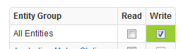
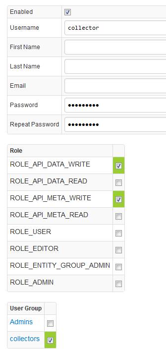

# Collector Account

We recommend creating a separate `collector` user account with limited permissions for data collection tasks. This account can be used in all clients, including Axibase Collector, when sending data into ATSD.

Follow these steps to create `collector` account in ATSD:

* Login into ATSD as administrator
* Open **Admin>Users>User Groups>Create** page and create `collectors` group with **[All Entities] Write** permission.

* Open **Admin>Users>Create** page and create `collector` user with **API_DATA_WRITE** and **API_META_WRITE** roles. 
* Click on `collectors` group to add `collector` user as the member of the this group.

