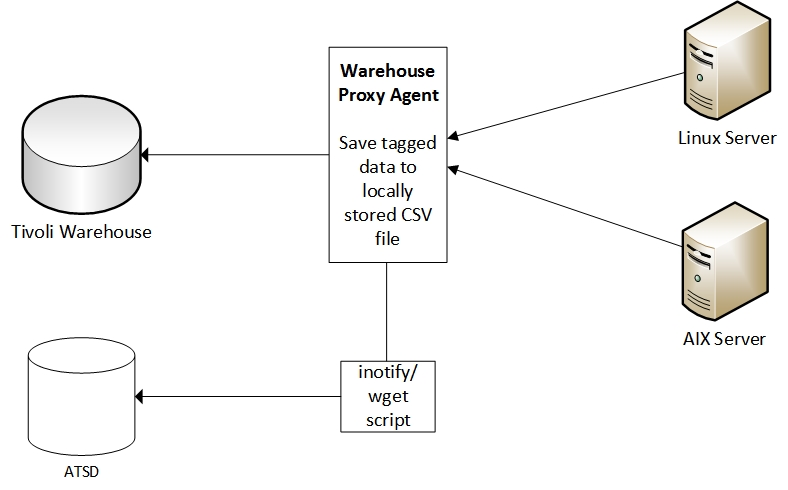

# IBM Tivoli Monitoring

## Overview
ATSD extends IBM Tivoli Monitoring with streaming analytics and
long-term detailed data retention capabilities.

## Installation steps

### Enabling ITM to stream data into the ATSD is done through the Warehouse Proxy Agent

- Import CSV parser definitions into ATSD for particular agent codes: UX, PA, LZ, NT, VM, T3, UD, etc.
- Configure [Warehouse Proxy Agent](http://www-01.ibm.com/support/knowledgecenter/SSATHD_7.7.0/com.ibm.itm.doc_6.3fp2/adminuse/history_analytics_scenarios.htm "WPA") to store analytical data into CSV files on the local file system.
- Enable private history collection on the agent.
- Read and upload CSV files into ATSD continuously using scripts.
- To minimize latency, watch for new CSV files using inotify or similar utility.

**hd.ini setting to enable private history streaming in ITM:**

<code><a href="hd.ini">THIS</a></code>.

### Enabling private history on agent
<code>I want <a href="lz_situations.xml">THIS</a></code>.
**Sender Script**

Sender script that checks the specified directory for new CSV files and
uploads them into ATSD.\
 You can check the script’s logs in `/tmp/itm/logs` directory.

### Verify Metrics in ATSD

* Login into ATSD
* Click on Metrics tab and filter metrics by prefix `klz`

## Viewing Data in ATSD

### Metrics
* List of collected [ITM metrics](metric-list.md)

### Entity Groups

- `ITM - Linux OS`

### Portals
- [ITM – Linux OS Portal](http://apps.axibase.com/chartlab/43f054ee)

