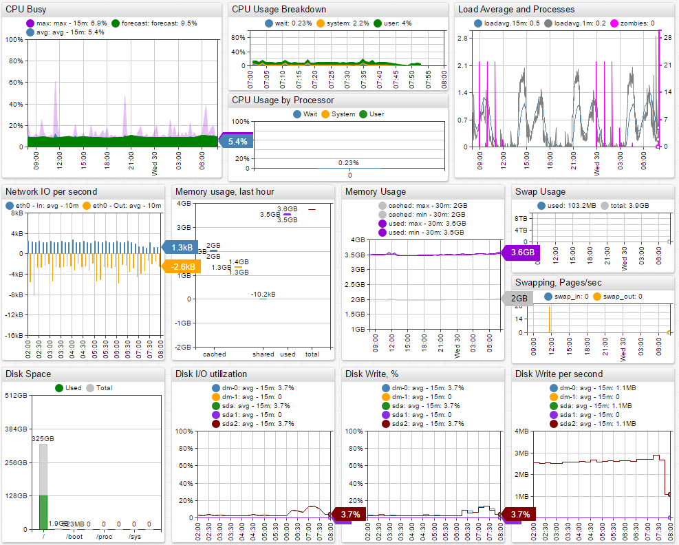

# IBM Tivoli Monitoring

## Overview
ATSD extends IBM Tivoli Monitoring with streaming analytics and
long-term detailed data retention capabilities.

## Installation steps

### Enabling ITM to stream data into the ATSD is done through the Warehouse Proxy Agent

- Import CSV parser definitions into ATSD for particular agent codes: UX, PA, LZ, NT, VM, T3, UD, etc.
- Configure [Warehouse Proxy Agent](http://www-01.ibm.com/support/knowledgecenter/SSATHD_7.7.0/com.ibm.itm.doc_6.3fp2/adminuse/history_analytics_scenarios.htm "WPA") to store analytical data into CSV files on the local file system.
- Enable private history collection on the agent.
- Read and upload CSV files into ATSD continuously using scripts.
- To minimize latency, watch for new CSV files using inotify or similar utility.

**`hd.ini` setting to enable private history streaming in ITM:**

```ini
KHD_CSV_OUTPUT_ACTIVATE=Y
KHD_CSV_OUTPUT=/tmp/itm/csv
KHD_CSV_OUTPUT_TAGGED_ONLY=Y
KHD_CSV_ISO_DATE_FORMAT=Y
KHD_CSV_MAXSIZE=400
KHD_CSV_EVAL_INTERVAL=60
```

### Enabling private history on agent
```xml
<PRIVATECONFIGURATION>
    <HISTORY Interval="1" Export="1" RETAIN="1" USE="A" Table="KLZ_CPU"></HISTORY>
    <HISTORY Interval="1" Export="1" RETAIN="1" USE="A" Table="KLZ_CPU_Averages"></HISTORY>
    <HISTORY Interval="1" Export="1" RETAIN="1" USE="A" Table="KLZ_Disk"></HISTORY>
    <HISTORY Interval="1" Export="1" RETAIN="1" USE="A" Table="KLZ_Disk_IO"></HISTORY>
    <HISTORY Interval="1" Export="1" RETAIN="1" USE="A" Table="KLZ_Disk_Usage_Trends"></HISTORY>
    <HISTORY Interval="1" Export="1" RETAIN="1" USE="A" Table="KLZ_IO_Ext"></HISTORY>
    <HISTORY Interval="1" Export="1" RETAIN="1" USE="A" Table="KLZ_Network"></HISTORY>
    <HISTORY Interval="1" Export="1" RETAIN="1" USE="A" Table="KLZ_NFS_Statistics"></HISTORY>
    <HISTORY Interval="1" Export="1" RETAIN="1" USE="A" Table="KLZ_LPAR"></HISTORY>
    <HISTORY Interval="1" Export="1" RETAIN="1" USE="A" Table="KLZ_Process"></HISTORY>
    <HISTORY Interval="1" Export="1" RETAIN="1" USE="A" Table="KLZ_Process_User_Info"></HISTORY>
    <HISTORY Interval="1" Export="1" RETAIN="1" USE="A" Table="KLZ_RPC_Statistics"></HISTORY>
    <HISTORY Interval="1" Export="1" RETAIN="1" USE="A" Table="KLZ_System_Statistics"></HISTORY>
    <HISTORY Interval="1" Export="1" RETAIN="1" USE="A" Table="KLZ_Sockets_Detail"></HISTORY>
    <HISTORY Interval="1" Export="1" RETAIN="1" USE="A" Table="KLZ_Sockets_Status"></HISTORY>
    <HISTORY Interval="1" Export="1" RETAIN="1" USE="A" Table="KLZ_Swap_Rate"></HISTORY>
    <HISTORY Interval="1" Export="1" RETAIN="1" USE="A" Table="KLZ_TCP_Statistics"></HISTORY>
    <HISTORY Interval="1" Export="1" RETAIN="1" USE="A" Table="KLZ_User_Login"></HISTORY>
    <HISTORY Interval="1" Export="1" RETAIN="1" USE="A" Table="KLZ_VM_Stats"></HISTORY>
    <HISTORY Interval="1" Export="1" RETAIN="1" USE="A" Table="Linux_All_Users"></HISTORY>
    <HISTORY Interval="1" Export="1" RETAIN="1" USE="A" Table="Linux_CPU_Config"></HISTORY>
    <HISTORY Interval="1" Export="1" RETAIN="1" USE="A" Table="Linux_Group"></HISTORY>
    <HISTORY Interval="1" Export="1" RETAIN="1" USE="A" Table="Linux_IP_Address"></HISTORY>
    <HISTORY Interval="1" Export="1" RETAIN="1" USE="A" Table="Linux_Machine_Information"></HISTORY>
    <HISTORY Interval="1" Export="1" RETAIN="1" USE="A" Table="Linux_OS_Config"></HISTORY>
    <HISTORY Interval="1" Export="1" RETAIN="1" USE="A" Table="Linux_File_Comparison"></HISTORY>
    <HISTORY Interval="1" Export="1" RETAIN="1" USE="A" Table="Linux_File_Information"></HISTORY>
    <HISTORY Interval="1" Export="1" RETAIN="1" USE="A" Table="Linux_File_Pattern"></HISTORY>
    <HISTORY Interval="1" Export="1" RETAIN="1" USE="A" Table="Linux_Host_Availability"></HISTORY>
</PRIVATECONFIGURATION>
```
**Sender Script**

Sender script that checks the specified directory for new CSV files and
uploads them into ATSD.\
 You can check the script’s logs in `/tmp/itm/logs` directory.

```sh
#!/bin/bash
scriptDir="`dirname $(readlink -f $0)`"
url="$1"
logPostfix="`date +%s`"
newcsvLog="$scriptDir/../logs/newcsv_${logPostfix}.log"
sendcsvLog="$scriptDir/../logs/send_${logPostfix}.log"
cleanLog="$scriptDir/../logs/cleaner_${logPostfix}.log"
csvDir="$scriptDir/../csv"
tmpDir="$scriptDir/../tmp"
if [ "$url" = "" ]; then
	url="http://10.102.0.6:8088"
fi
touch $newcsvLog

function clean_up {
    ps -ef | grep "inotifywait -qdm --format %f -e moved_to -o $newcsvLog $csvDir" | awk '{print $2}' | xargs kill -9
    ps -ef | grep "$0" | awk '{print $2}' | xargs kill -9
}

trap clean_up SIGINT SIGTERM

function cleaner {
    while :
    do
        find $csvDir/ -type f -mmin +3 -exec basename {} \; | while read csvName
        do
    	    rm -f $csvDir/$csvName
    	    echo "rm as old: $csvDir/$csvName >> $cleanLog"
        done

        find $csvDir/ -type f -mmin +1 -mmin -2 -exec basename {} \; | while read csvName
        do
    	    send $csvName cleaner &
        done
        sleep 65
    done
}

function send {
    csvName="$1"
    byCleaner="$2"
    tmpLog=$tmpDir/$csvName
    touch $tmpLog
    ok="awaiting response... 200"
    error="awaiting response... 500"
    type="`echo $csvName | tr "_" "\n" | head -n1`"

    if [[ -n $(find $csvDir/$csvName -mmin -1 2>/dev/null) ]] || [ "$byCleaner" != "" ]; then
        wget -t 1 -T 10 --header="Content-type:text/csv" -O - --post-file="$csvDir/$csvName" "$url/csv?config=$type&processEvents=false&nowait=true" 2>$tmpLog
        ( grep -q "$ok" $tmpLog && echo `date`: ok $csvName >> $sendcsvLog && rm -f $csvDir/$csvName ) || ( grep -q "$error" $tmpLog && echo `date`: error $csvName >> $sendcsvLog && cat $tmpLog >> $sendcsvLog ) ||
        ( echo `date`: unknown $csvName >> $sendcsvLog && cat $tmpLog >> $sendcsvLog )

        echo "--------------------" >> $sendcsvLog
    fi
    rm -rf $tmpLog
}

rm -f $csvDir/*

cleaner &

inotifywait -qdm --format %f -e moved_to -o $newcsvLog $csvDir
tail -f $newcsvLog | while read csvName
do
	send $csvName &
done
```


### Verify Metrics in ATSD

* Login into ATSD
* Click on Metrics tab and filter metrics by prefix `klz` and `lnx`


## Viewing Data in ATSD

### Metrics
* List of collected [ITM metrics](metric-list.md)

### Entity Groups

- `ITM - Linux OS`

### Portals
- [ITM – Linux OS Portal](http://apps.axibase.com/chartlab/43f054ee)




