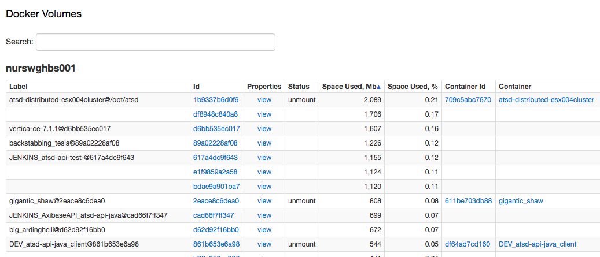

# Monitoring Docker Volume Usage

## Overview

Monitoring disk space usage with a breakdown by individual container ensures continuous service availability by preventing space leakages in containers with data (persistent) volumes.

While the Docker [command line](https://docs.docker.com/engine/reference/commandline/ps/) provides a way to obtain container sizes using the `--size` flag, the command may take several minutes to complete while significantly overloading the hosts disk subsystem and slowing down API requests in the Docker engine. Besides, parsing the output of a `docker ps --size` command requires handling size units (kb, mb, gb) and doesn't expose space usage by volume.

  ```sh
  axibase@NURSWGHBS001:~$ docker ps -s --format "{{.ID}}\t{{.Names}}\t{{.Size}}"
  ```

  ```sh
  a832af264060	JENKINS_atsd-api-test_	132.3 kB (virtual 984.1 MB)
  d7f87797f36e	distracted_williams	323 MB (virtual 1.821 GB)
  f53cf366a4c6	stupefied_hamilton	323 MB (virtual 1.821 GB)
  d6d362779455	sad_spence	446.5 MB (virtual 1.944 GB)
  fa510d6c9a9a	ve-7.1.1	1.518 GB (virtual 2.244 GB)
  75caaa907eab	axibase_collector	5.942 GB (virtual 20.38 GB)
  ...
  ```

For example, on a Docker host where the `/var/lib/docker` size is 30Gb with 20 running containers and 80 in total, the initial execution of the `docker ps -as` command takes more than 2 minutes while full loading the host's I/O.

  ```sh
  axibase@NURSWGHBS001:~$ time docker ps -as
  CONTAINER ID   IMAGE                             COMMAND                  CREATED         STATUS         PORTS                     SIZE
  83010924db3c   axibase/atsd_package_validation   "/bin/bash /root/chec"   5 minutes ago   Up 3 minutes   atsd_package_validation   561.7 MB (virtual 818.9 MB)
  ...
  real	2m51.218s
  user	0m0.026s
  sys	0m0.032s
  ```


Executing API requests with the `&size=1` parameter typically requires even more time than the `docker ps -as` command and may cause timeout issues for API clients.

## Alternative

One of the "lesser evil" alternatives is to calculate disk usage of `/var/lib/docker` subdirectories using the `ds` command. This requires superuser privileges.

  ```sh
  sudo bash -c 'du -hs /var/lib/docker/volumes/*'
  ```

> Note: We're using the `bash -c` wrapper here as a permission-safe way to pass the * wildcard.

  ```
  177M	/var/lib/docker/volumes/dd1e8b1942e204054b8a56219e523834d35bd8e84283720daf227823eae9b21f
  174M	/var/lib/docker/volumes/de9a1746ea49e702accfb732ee74354c6291c2356a5319693868533fbeb40765
  363M	/var/lib/docker/volumes/df81a9b753aa9464935af03b8e3dc57fa53cacaa1910a80dc4f1e6b9f952fb77
  1.7G	/var/lib/docker/volumes/df8948c840a882070c9ed10f01bf3c6b594a0095f236f47af124cf9d76dee165
  1.1G	/var/lib/docker/volumes/e1f9859a2a58a8071805597e3e4ea71d45e67cda13dbb9630742e654c379d544
  307M	/var/lib/docker/volumes/eb3952dec29e293cfae8149b20c40859ac944723abd28666e093ab1d76b43a0c
  ```

The following [collector](docker_volume_collect.sh) script executes the `ds` command to calculate total disk usage of each subdirectory in the `/var/lib/docker/volumes/` directory, as well as computes the percentage of the total size of the underlying file system, used by each volume.

### Running

* Print commands to stdout:

  ```sh
  sudo ./docker_volume_collect.sh
  ```

* Print commands to file:

  ```sh
  sudo ./docker_volume_collect.sh >> /tmp/docker-volumes.out
  ```

* Send commands to ATSD:

  ```sh
  sudo ./docker_volume_collect.sh > /dev/tcp/{atsd_hostname}/8081
  ```

### Sample commands

  ```ls
  series e:f867330fd3e9f103388ed84325c4432a4dce2cdebfb7db22f46940bcecc81225 m:docker.volume.used=179724 d:2016-12-27T11:12:39Z t:docker-host="nurswghbs001"
  series e:f867330fd3e9f103388ed84325c4432a4dce2cdebfb7db22f46940bcecc81225 m:docker.volume.used_percent=0.0175442 d:2016-12-27T11:12:39Z t:docker-host="nurswghbs001"
  series e:nurswghbs001 m:docker.volume.total_used=32424032 d:2016-12-27T11:12:39Z
  series e:nurswghbs001 m:docker.volume.total_used_percent=3.16514 d:2016-12-27T11:12:39Z
  ```

### Scheduling

* To send commands to ATSD on schedule:

  ```sh
  su root
  crontab -e
  ```

* Add the task to crontab to collect data every 15 minutes:

  ```
  */15 * * * * /opt/scripts/docker_volume_collect.sh > /dev/tcp/{atsd_hostname}/8081
  ```

## Collected Metrics

| **Metric Name** | **Description** |
|---|---|
|docker.volume.fs.size | Total size (used + available, in bytes) of the file system where the `/var/lib/docker` directory is located. Collected for the entire docker host. |
|docker.volume.total_used | Total space (in bytes) used by the `/var/lib/docker` directory. Collected for the entire docker host. |
|docker.volume.total_used_percent | Percentage of space used by the `/var/lib/docker` directory in the file system where the `/var/lib/docker` directory is located. Calculated as docker.volume.total_used/docker.volume.fs.size * 100. Collected for the entire docker host. |
|docker.volume.used | Space used by all files in the given volume (in bytes).|
|docker.volume.used_percent | Space used by files in the given volume as percentage of the total size of the file system where the `/var/lib/docker` directory is located. Calculated as docker.volume.used/docker.volume.fs.size * 100.

## Volume View

To display volume sizes, import the [updated Entity View](volume-entity-view.xml) for Docker Volumes via ATSD -> [Configuration] -> Entity Views -> [Import] with the 'Replace Existing Entity Views' option enabled.



## Volume Disk Rules

Import the [rules](https://github.com/axibase/axibase-collector-docs/blob/master/jobs/docker/volume-rules.xml) file to raise an alert whenever a volume consumes more than 50% of total file system size.

| Rule Name | Description |
|---|---|
|docker-host-volume-space-low | Raise an alert if the total size of the `/var/lib/docker` directory exceeds 60% of the total space on the file system. |
| docker-volume-space-leak| Raise an alert if the volume consumes more than 25% of the total space on the file system where `/var/lib/docker` is located.|
