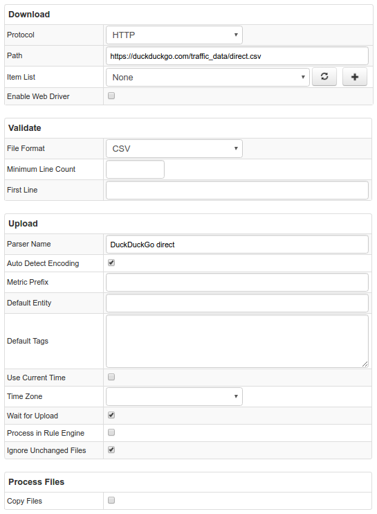

# Example of File configuration to retrieve statistical data from duckduckgo.com

## Motivation

We are going to learn how to setup job configuration to retrieve files via HTTP and send them to ATSD. In this example we will be working with [duckduckgo statistics](https://duckduckgo.com/traffic_data/direct.csv) file which keeps the number of daily processed queries 

## Data Format

Retrieved data is a simple CSV file containing 2 columns: `Date` and `Queries`, separated by a comma. `Date` is a complete ISO-8601 date. `Queries` is a number of queries processed by duckduckgo for a given day. Rows are separated by a spacebar.
Example:
```csv
Date,Queries 2010-04-01,33209 2010-04-02,35873 2010-04-03,34230
```

## Configuration

We should choose HTTP Type, specify location of needed file in Path field, choose CSV File Format and provide the name of predefined CSV Parser in ATSD.
You may import [this parser configuration](./configs/duckduckgo_parser.xml)  in ATSD to get things working. 


You may import [job configuration](./configs/duckduckgo.xml) for this example.

## Additional Examples

* [Nginx statistics](./examples/file/nginx-statistics.md)
* [Storms statistics](./examples/file/storms.md)
