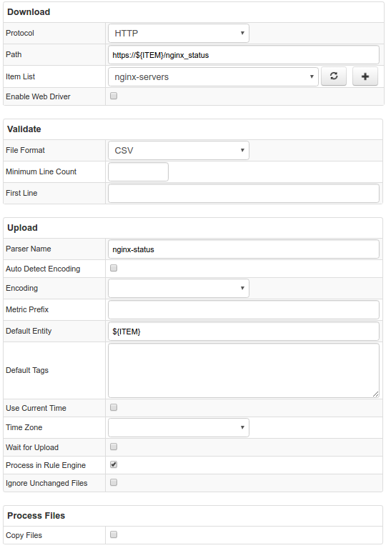

# Example of File configuration to monitor nginx statistics

## Motivation

We are going to learn how to process several files in one configuration using Item Lists. This configuration will allow us to monitor the status of different nginx servers.

## Data Format

Data is represented in a specific format. First row contains number of active connections after colon. Third row contains number of accepted, handled and total requests, each number divided by space. Fourth row contains number of active connections in reading, writing, waiting state. See more in nginx [documentation](https://nginx.org/en/docs/http/ngx_http_stub_status_module.html) 
Example:
```
Active connections: 7 
server accepts handled requests
 1308441 1308441 342390 
Reading: 0 Writing: 1 Waiting: 6
```


## Configuration

We should choose HTTP Type, in Path field we use ${ITEM} placeholder in the position where items from given Item List will be inserted. In Item List field we choose predefined Item List containing hosts we want to get statistics from. Choose CSV File Format. Parser Name should be the same as in corresponding Parser in ATSD.
You may import [this parser configuration](./configs/nginx_parser.xml) in ATSD to get things working. 

You may import [job configuration](./configs/nginx-statistics.xml) for this example.

## Other Examples

* [Duckduckgo statistics](./examples/file/duckduckgo.md)
* [Storms statistics](./examples/file/storms.md)