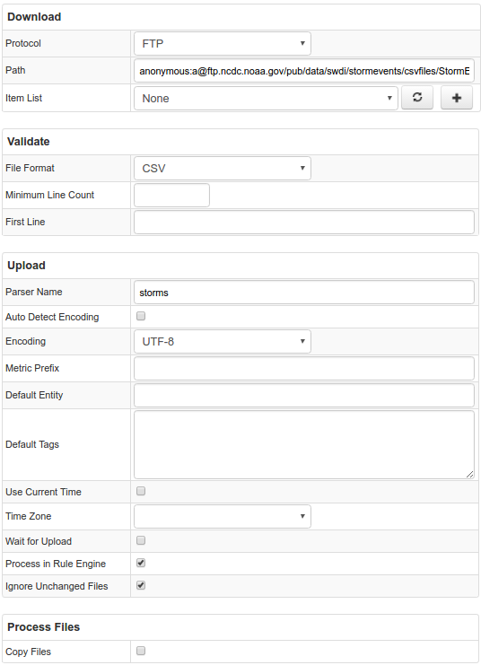

# Example of File configuration to retrieve data from FTP servers

## Motivation

We are going to learn how to setup job configuration to retrieve files via FTP and send them to ATSD. In this example we will be working with [storms data](http://www.ncdc.noaa.gov/stormevents/ftp.jsp). The public FTP server contains historical data about storms in the USA. As an example, we will retrieve data for 1980's using wildcards.

## Data Format

Example:
Retrieved data is a bunch of CSV files. Their format is described in the [document](http://www1.ncdc.noaa.gov/pub/data/swdi/stormevents/csvfiles/Storm-Data-Export-Format.docx)
```csv
BEGIN_YEARMONTH,BEGIN_DAY,BEGIN_TIME,END_YEARMONTH,END_DAY,END_TIME,EPISODE_ID,EVENT_ID,STATE,STATE_FIPS,YEAR,MONTH_NAME,EVENT_TYPE,CZ_TYPE,CZ_FIPS,CZ_NAME,WFO,BEGIN_DATE_TIME,CZ_TIMEZONE,END_DATE_TIME,INJURIES_DIRECT,INJURIES_INDIRECT,DEATHS_DIRECT,DEATHS_INDIRECT,DAMAGE_PROPERTY,DAMAGE_CROPS,SOURCE,MAGNITUDE,MAGNITUDE_TYPE,FLOOD_CAUSE,CATEGORY,TOR_F_SCALE,TOR_LENGTH,TOR_WIDTH,TOR_OTHER_WFO,TOR_OTHER_CZ_STATE,TOR_OTHER_CZ_FIPS,TOR_OTHER_CZ_NAME,BEGIN_RANGE,BEGIN_AZIMUTH,BEGIN_LOCATION,END_RANGE,END_AZIMUTH,END_LOCATION,BEGIN_LAT,BEGIN_LON,END_LAT,END_LON,EPISODE_NARRATIVE,EVENT_NARRATIVE,DATA_SOURCE
196609,5,830,196609,5,830,,9985065,"FLORIDA",12,1966,"September","Tornado","C",103,"PINELLAS",,"05-SEP-66 08:30:00","CST","05-SEP-66 08:30:00","0","0","0","0","0K","0",,"0",,,,"F0","0","10",,,,,"0",,,"0",,,"27.97","-82.80",,,,,"PUB"
```

## Configuration

We should choose FTP Type. Path contains of credentials, server, and path on the server. Login `anonymous` with any password will allow to connect without credentials. The needed data are kept in the directory ftp.ncdc.noaa.gov/pub/data/swdi/stormevents/csvfiles/. We may use symbol `?` to fetch any symbol. Full Path can be: anonymous:a@ftp.ncdc.noaa.gov/pub/data/swdi/stormevents/csvfiles/StormEvents_details-ftp_v1.0_d198?_*.csv.gz.
We check Ignore Unchanged Files, so we won't upload historical data that are already in ATSD.
You may import [this parser configuration](./configs/storms_parser.xml) in ATSD to get things working.

You may import [job configuration](./configs/storms.xml) for this example.

## Additional Examples

* [Nginx statistics](./examples/file/nginx-statistics.md)
* [Duckduckgo statistics](./examples/file/duckduckgo.md)