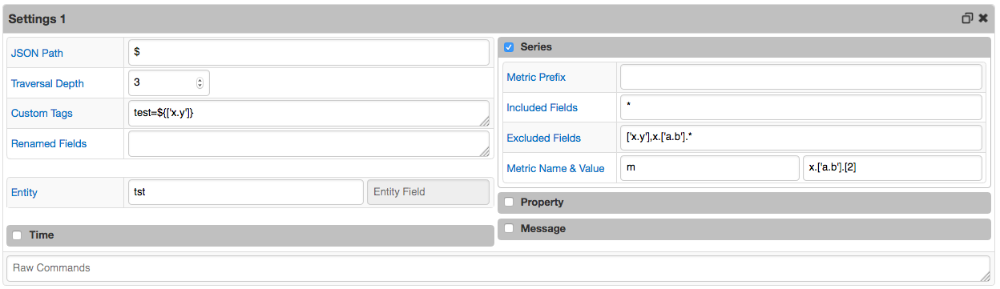
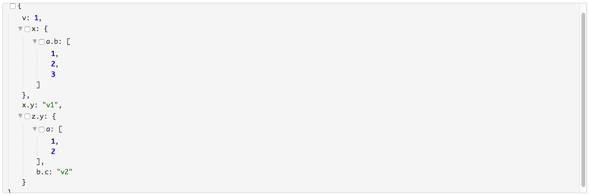

# JSON Job Example: Fields with dot

## Overview

The field with dot is not accessible by it's name directly, use square brackets and single quotes to access the field, for example ['x.y'].

## JSON

```json
{
  "v": 1,
  "x": {
    "a.b": [
      1,
      2,
      3
    ]
  },
  "x.y": "v1",
  "z.y": {
    "a": [
      1,
      2
    ],
    "b.c": "v2"
  }
}
```

[JSON](fields_with_dot.json) file.

## Configuration

Field Name | Field Value
:--------- | :----------
Format     | JSON

### Settings

Field Name         | Field Value
:----------------- | :----------
Default Entity     | tst
JSON Path          | $
Depth              | 3
Custom Tags        | tag=${['x.y']}
Included Fields    | *
Excluded Fields    | ['x.y'],x.['a.b'].*
Metric Name Field  | m
Metric Value Field | x.['a.b'].[2]

[JSON Job Configuration](fields_with_dot.xml) file. Import xml into Collector.

## Matched Object

```javascript
$
```

```json
{
   "v": 1,
   "x": {
      "a.b": [
         1,
         2,
         3
      ]
   },
   "x.y": "v1",
   "z.y": {
      "a": [
         1,
         2
      ],
      "b.c": "v2"
   }
}
```

## Commands

```ls
series e:tst d:2017-03-01T11:13:56.344Z t:test=v1 t:['z.y'].['b.c']=v2 m:v=1 m:['z.y'].a.[1]=2 m:['z.y'].a.[0]=1 m:m=3
```

## Screenshots

### Configuration


### Settings


### Viewer


### Test Results

