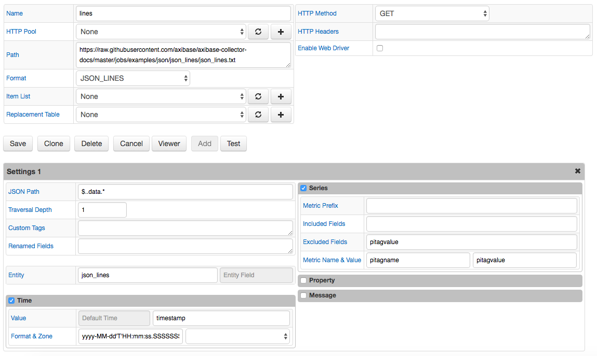

# JSON Job Example: JSON Lines

## Description

JSON Lines is a text format, also called [newline-delimited JSON](http://jsonlines.org/).

## Local File

[JSON Lines](json_lines.txt) file

## Configuration

[JSON job configuration](json_job_configuration.xml). Import xml into Collector.

## Screenshot

