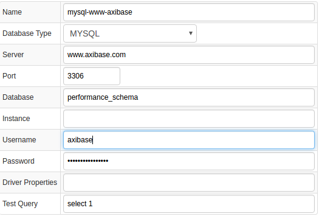

# MySQL Server

## Overview

[MySQL](http://www.mysql.com/) is a free, open-source database engine available for all major platforms. (Technically, MySQL is a relational database management system (RDBMS).) MySQL represents an excellent introduction to modern database technology, as well as being a reliable mainstream database resource for high-volume applications.

## Requirements

- MySQL Server `5.7+`

## Installation steps

### Import MySQL Server job

* Open **Jobs:Import** and upload [mysql-server-jobs.xml](mysql-server-jobs.xml) file

### Configure MySQL Server Database Connection

* Open **Data Sources:Databases** page, select `10.102.0.7` database.
* Provide connection parameters to the target MySQL Server database as displayed below:



* Execute the following test query to check the connection:

```SQL
SELECT 1
```
* Query result must be `Query OK`.

### Verify Job Configuration

* Open MySQL Server job
* Set Data Source to `mysql-www-axibase`


* Choose one of target ATSD instances if your Collector instance is connected to multiple ATSD servers.
* Save the Job
* Open each configuration, click on `Test` button and review output. See [Data Queries](#data-queries) below.


### Schedule the Job

* Open `JDBC Job` page and click `Run` button for the MySQL Server JDBC job.
* Make sure that the job status is `COMPLETED` and `Items Read` and `Sent commands` are greater than 0.


* If there are no errors, set job status to Enabled and save the job

### Verify Metrics in ATSD

* Login into ATSD
* Click on Metrics tab and filter metrics by name `mysql.*`


## Viewing Data in ATSD

### Metrics

* List of collected [MySQL Server metrics](metric-list.md)

### Entity Groups

### Portals

## Data Queries

* Metrics Queries select most recent statistics 

```SQL
SELECT * FROM global_status WHERE variable_name NOT LIKE 'Innodb_%_status'
AND variable_name NOT IN ('Max_used_connections_time', 'Ssl_server_not_after', 'Ssl_server_not_before', 'Ssl_session_cache_mode')
```


