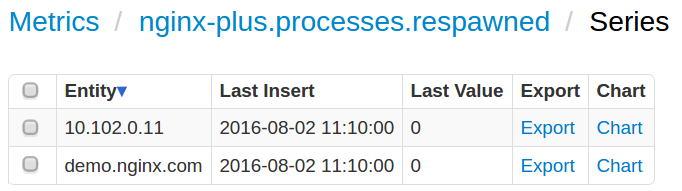

# NGINX Plus Web Server Monitoring
## Overview

This document describes how to collect various metrics from an NGINX PLUS web server for long-term retention and monitoring in Axibase Time Series Database.

The periodic data collection can be organized in several ways:
* Configuring Axibase Collector json job to periodically poll server's status page and upload obtained data for parsing in ATSD.
* Using [axibase_nginx_plus_collector](https://github.com/axibase/axibase-collector-docs/tree/master/jobs/examples/nginx-plus/axibase-nginx-plus-collector) python script along with an OS sheduler. This way is described at plus_collector page](https://github.com/axibase/axibase-collector-docs/tree/master/jobs/examples/nginx-plus/axibase-nginx-plus-collector)

The document will provide instructions for the first way of configuring.
## Requirements
* NGINX PLUS server with [ngx_http_status_module](http://nginx.org/en/docs/http/ngx_http_status_module.html) enabled.
* [Axibase Collector](https://github.com/axibase/axibase-collector-docs/blob/master/README.md) for scheduled polling of the NGINX status page.
* [Axibase Time Series Database](https://github.com/axibase/atsd-docs/blob/master/installation/README.md) as a centralized data repository.

## Configure a job in Axibase Collector
Axibase Collector will poll the NGINX PLUS status page every 5 seconds, build network commands and send them to ATSD.

Login into Axibase Collector web interface
### Create Item List for NGINX PLUS servers
* Open **Collections:Item Lists** page
* Add a new TEXT [Item List](/collections.md) named **nginx-plus-servers** containing DNS names or IP addresses of the monitored NGINX PLUS servers, one server per line. <br>Make sure that each server on the list is accessible on the specified protocol and port and exposes the status page on the same path `/status`. <br>If the protocols and ports are different, move the entire url to the list and set Path field to equal `${ITEM}` placeholder.
* **Save** the list.


### Import a job
* Import [nginx-plus-collector-job.xml](./configs/nginx-plus-collector-job.xm) job on **Jobs:Import** page.
* Open the `nginx-plus-statistics` JSON job. 
* If 'Storage' drop-down is set to `None`, select the target ATSD server.
* Set Status to Enabled.
* **Save** the job.
The job consists of several settings blocks, each of which is responsible for processing specific data from nginx plus status page. Each block forms special `series` and `property` commands for ATSD depending on what is being processed by the block. For example, the first settings block is responsible for processing general information about an NGINX PLUS Server. This block will fetch different metrics about *connection*, *ssl handshakes*, *requests*, *respawned processses* of the server and get its general properties such as *address*, *nginx_version*, *load_timestamp*, etc.

The result `series` and `property`commands formed by the block will look like the following ones:

```ls
series e:demo.nginx.com d:2016-08-02T10:35:46.608Z m:nginx-plus.connections.accepted=40750818 m:nginx-plus.connections.dropped=0 m:nginx-plus.requests.current=11 m:nginx-plus.ssl.handshakes=45602 m:nginx-plus.connections.idle=34 m:nginx-plus.requests.total=85010375 m:nginx-plus.processes.respawned=0 m:nginx-plus.ssl.session_reuses=7504 m:nginx-plus.connections.active=11 m:nginx-plus.ssl.handshakes_failed=6641
property t:nginx_info e:demo.nginx.com d:2016-08-02T10:35:46.608Z k:address=206.251.255.64 v:nginx_version=1.9.13 v:pid=12121 v:load_timestamp=1469872800422 v:generation=17 v:version=6
```
### Validate Data Availability

* Open `nginx-plus-status` configuration in `nginx-plus-statistics` job.
* Click Test to verify processing.


* Login into ATSD web interface.
* Open Metrics tab and apply `nginx-plus*` name mask to view nginx metrics received by ATSD.
* Click on Series link and check that metrics are present for each server in in the **nginx-plus-servers** list.



# Viewing Data in ATSD 

## Metrics

List of collected [NGINX PLUS server metrics](./nginx-plus-server-metrics.md)

## Entity Group
* Open **Admin:Entity Groups**, click Import button and upload [nginx_plus_entity_group.xml](./configs/nginx-plus-entity-group.xml)
* Select imported nginx-plus-servers group
* Verify that the group contains your NGINX servers

## Portal
* Open **Configuration: Portals** click Import button and upload [nginx-plus-portal.xml](./configs/nginx-plus-portal.xml).
* Click **Assign** link and associate the portal with the entity group you created earlier
* Open *Entity* tabs, find the NGINX PLUS servers you would like to see information about, and click on its portal icon

[NGINX PLUS Status portal example](http://apps.axibase.com/chartlab/f9637acd)
