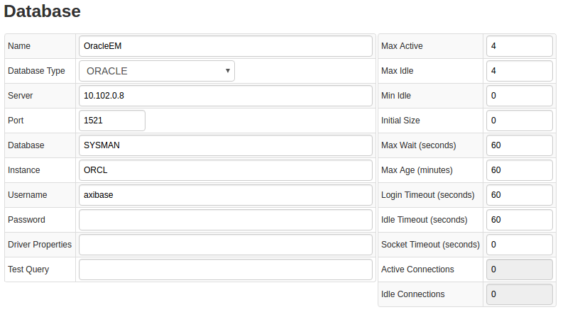
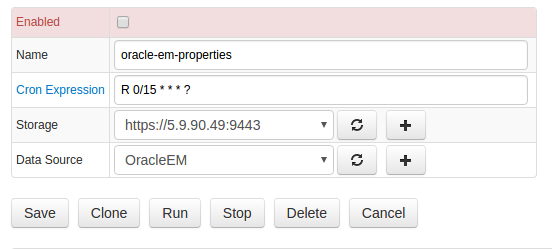

# Oracle Enterprise Manager

## Overview
[Oracle Enterprise
Manager](http://www.oracle.com/us/products/enterprise-manager/index.html "Oracle Enterprise Manager") is centralized monitoring solution for testing, deploying, operating, monitoring, diagnosing, and resolving issues related to Oracle products.

## Supported versions

- Oracle Enterprise Manager 11+.

## Installation steps

### Imptort job from files
You can download the oem-jobs.xml file and import it from the Jobs tab in Axibase Collector for a quick setup. Be sure to select your ATSD server and Data Source after you have imported the collector job xml file.
> [oracle-em-jobs.xml](oracle-em-jobs.xml)

#### Queries

This file contains two jobs with different queries to Oracle database.

##### Metric


| Query 1 |
| --- |
|
```SQL
SELECT ENTITY_NAME, ENTITY_TYPE || '.' || REPLACE(REPLACE(METRIC_GROUP_LABEL, ',', ' '), ' ', '_') || '.' ||
REPLACE(REPLACE(TRIM(REPLACE(REPLACE(REPLACE(REPLACE(METRIC_COLUMN_LABEL, ' - ', '-'), ',', ' '), ')', ' '), '(', ' ')), ' ', '_'), '__', '_') AS METRIC,
NULLIF(KEY_PART_1, '%') AS KEY, NULLIF(KEY_PART_2, '%') AS KEY_2, NULLIF(KEY_PART_3, '%') AS KEY_3, NULLIF(KEY_PART_4, '%') AS KEY_4,
NULLIF(KEY_PART_5, '%') AS KEY_5, NULLIF(KEY_PART_6, '%') AS KEY_6, NULLIF(KEY_PART_7, '%') AS KEY_7, COLLECTION_TIME_UTC, VALUE
FROM SYSMAN.gc$metric_values
WHERE ENTITY_TYPE = 'oracle_database' AND METRIC_GROUP_LABEL_NLSID IS NOT NULL AND COLLECTION_TIME_UTC >= ? ORDER BY COLLECTION_TIME_UTC
```
|
- Query 2

```SQL
SELECT ENTITY_NAME, ENTITY_TYPE || '.' || REPLACE(REPLACE(METRIC_GROUP_LABEL, ',', ' '), ' ', '_') || '.' ||
REPLACE(REPLACE(TRIM(REPLACE(REPLACE(REPLACE(REPLACE(METRIC_COLUMN_LABEL, ' - ', '-'), ',', ' '), ')', ' '), '(', ' ')), ' ', '_'), '__', '_') AS METRIC,
NULLIF(KEY_PART_1, '%') AS KEY, NULLIF(KEY_PART_2, '%') AS KEY_2, NULLIF(KEY_PART_3, '%') AS KEY_3, NULLIF(KEY_PART_4, '%') AS KEY_4,
NULLIF(KEY_PART_5, '%') AS KEY_5, NULLIF(KEY_PART_6, '%') AS KEY_6, NULLIF(KEY_PART_7, '%') AS KEY_7, COLLECTION_TIME_UTC, VALUE
FROM SYSMAN.gc$metric_values
WHERE ENTITY_TYPE = 'host' AND COLLECTION_TIME_UTC >= ? ORDER BY COLLECTION_TIME_UTC
```
### Properties

```SQL
SELECT 'oem.' || TARGET_TYPE AS TTYPE, TARGET_NAME, HOST_NAME, DISPLAY_NAME, TIMEZONE_REGION, TYPE_QUALIFIER1 AS TYPE
FROM SYSMAN.GC$TARGET
WHERE TARGET_TYPE IN ('host', 'oracle_database')
```

###  Datasource configure
> Log in Axibase collector interface and go to Datatsources->Databases and select `OracleEM` database. Fill form's fields like screenshot above:



Now verify that connection is ok by executing following test SQL query:
```SQL
SELECT NULL FROM dual
```
> Click on `Metadata` button

You must see `SYSMAN` schema in returned schema list


### Configure imported jobs' fields for you

For each imported job you need to do next steps


#### Select storage
> If your collector instance has connected to multiple atsd servers, you must choose one of them if `Storage` field.

#### Save changes
Click `Save` button on job page.


## Verifying configurations
After configuration you need to verify that it works correctly.
### Check datasource
> Go to Jobs->JDBC, find and open imported job.  Check that choosen database is right  or configure.


### Test query
Select query in job queries' list. Run `Test`  button. If query is correct, you must see something like this:


### Check that job work correctly

Go to `JDBC Job` page and click `Run` button. Make sure that job's status is `COMPLETED` and values of fields `Items Read` and `Sent commands` greater than 0.


Now you can enable this job.


## Metric list
You can view full list of this product [here](metric-list.md)

## Entity group list
Entities collecting Oracle Enterprise Manager data are automatically grouped in ATSD.

Oracle Enterprise Manager entity group names:

- Oracle EM Databases
- Oracle EM Hosts


## Portal List
Default visualization portals for Oracle Enterprise Manager entities are included in ATSD.
Default Oracle Enterprise Manager portal names:
##### Oracle Databases Portal
[Launch](http://axibase.com/chartlab/32a3fe3e)


##### Oracle Host Portal
[Launch](http://axibase.com/chartlab/32a3fe3e/2/)


