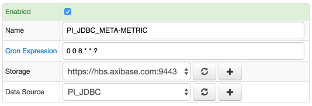
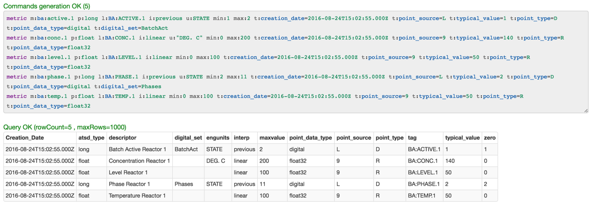
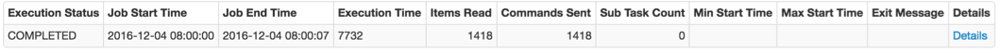
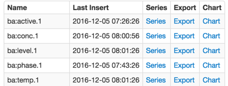

# PI Server

## Overview

This document describes how to collect metrics from [PI Server](http://www.osisoft.com/pi-system/pi-capabilities/pi-server/) into the Axibase Time Series Database.

The process involves enabling a JDBC job in Axibase Collector to poll PI tags as ATSD metrics.

## Requirements

- PI SQL Data Access Server `1.5+`
- PI JDBC Driver `1.5+`

## Installation Steps

## Provide Axibase Collector with PI JDBC Driver

* Install the PI JDBC Driver:
```sh
cd $PATH_TO_PI_JDBC_DRIVER_ARCHIVE
tar -xzvf pijdbc_2016-x86-x64_.tar.gz
cd pijdbc_2016-x86-x64_/pipc/jdbc
sudo ./install.sh
sudo chown -R $USER /opt/pipc
```

* Copy the PI JDBC Driver to Collector's `ext` folder:

```sh
cp /opt/pipc/jdbc/PIJDBCDriver.jar $AXIBASE_COLLECTOR_HOME/ext/
```

* Restart Axibase Collector:

```sh
$AXIBASE_COLLECTOR_HOME/bin/stop-collector.sh
$AXIBASE_COLLECTOR_HOME/bin/start-collector.sh
```

### Import PI Server jobs into Axibase Collector

* Open **Jobs:Import** and upload the file [pi_jdbc_metric.xml](pi_jdbc_metric.xml).

### Configure PI Server Database Connection

* Open the **Data Sources:Databases** page and select the `PI_JDBC` database.
* Provide connection parameters to the target PI Server instance as displayed below:


* Execute the following test query to check the connection:

```SQL
SELECT 1
```
* Query result must be `Query OK`.


### Verify Job Configuration

* Open the PI_JDBC_META_METRIC job.
* Set the Data Source to `PI_JDBC`.



* Choose one of the target ATSD instances if your Collector instance is connected to multiple ATSD servers.
* Save the Job.
* Open each configuration, click on the [Test] button, and review the output.



### Schedule the Job

* Open the `JDBC Job` page and click the [Run] button for the PI Server jobs.
* Make sure that the job status is `COMPLETED` and `Items Read` and `Sent commands` are greater than 0.



* If there are no errors, set the job status to 'Enabled' and save the job.

### Verify Metrics in ATSD

* Login into ATSD.
* Click on the Entity tab and filter entities by name `pi.default`.

* Click on date in Metrics column. You should see a list of exported PI tags



