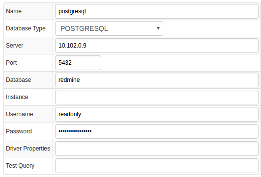
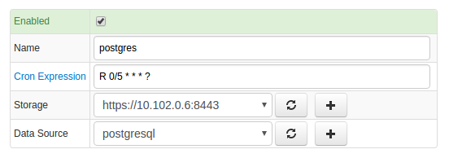
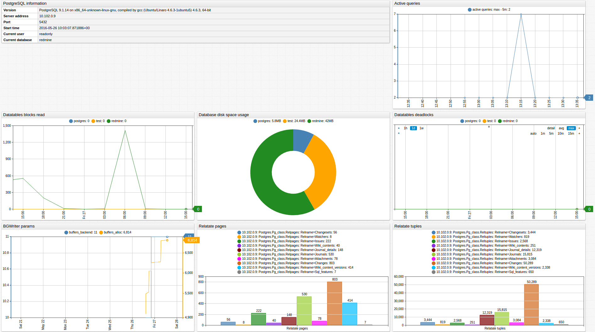

# PostgreSQL

## Overview
This document describes how to collect statistics' metrics introduced in [PostgreSQL](http://www.mysql.com/) 8.1+ for long-term retention and monitoring in Axibase Time Series Database.

The process involves enabling a JDBC job in Axibase Collector to poll statistics' tables and and uploading the counters into ATSD for processing.

## Requirements

- PostgreSQL `8.1+`

## Installation steps


### Import PostgreSQL job into Axibase Collector

* Open **Jobs:Import** and upload [postgres-job.xml](postgres-server-job.xml) file

### Configure PostgreSQL Database Connection

* Open **Data Sources:Databases** page, select `10.102.0.9` database.
* Provide connection parameters to the target PostgreSQL database as displayed below:



* Execute the following test query to check the connection:

```SQL
SELECT 1
```
* Query result must be `Query OK`.

### Verify Job Configuration

* Open PostgreSQL job
* Set Data Source to `10.102.0.7`



* Choose one of target ATSD instances if your Collector instance is connected to multiple ATSD servers.
* Save the Job
* Open each configuration, click on `Test` button and review output. See [Data Queries](#data-queries) below.


### Schedule the Job

* Open `JDBC Job` page and click `Run` button for the PostgreSQL JDBC job.
* Make sure that the job status is `COMPLETED` and `Items Read` and `Sent commands` are greater than 0.


* If there are no errors, set job status to Enabled and save the job

### Verify Metrics in ATSD

* Login into ATSD
* Click on Metrics tab and filter metrics by name `postgres.*`


## Viewing Data in ATSD

### Metrics

* List of collected [PostgreSQL metrics](metric-list.md)

### Entity Groups

* Open **Admin: Entity Groups** page
* Create a new Entity Group, click on Expression 'Edit mode' and enter the following expression:

```javascript
hasMetric('postgres.global_status.uptime')
```

* Save and verify that the group contains your PostgreSQL database hosts


### Portals

* Open **Configuration: Portals** page and import a postgres portal from [portal-postgres.xml](portal-postgres.xml).
* Click Assign link and associate the portal with the entity group you created earlier
* Open Entity tabs, find postgres database by name, and click on its portal icon


[PostgreSQL Portal](http://apps.axibase.com/chartlab/9a720f9e)



## Data Queries

Metrics Queries select most recent statistics described in this [file](data-queries.md).


