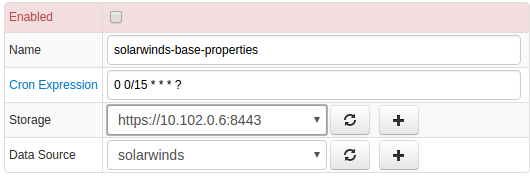

# SolarWinds

## Overview

[SolarWinds](http://www.solarwinds.com/ "SolarWinds") provides network
monitoring software that allows you to quickly detect, diagnose and
resolve network performance issues and outages.

## Requirements

- SolarWinds ToolSet `11+`

## Installation steps

### Import SolarWinds JDBC job

* Open **Jobs:Import** and upload [collector-jobs-solarwinds-base-jobs.xml](collector-jobs-solarwinds-base-jobs.xml) file

### Configure SolarWinds Database Connection

* Open **Data Sources:Databases** page, select `` database.
* Provide connection parameters to the target Microsoft SCOM database as displayed below:


* Execute the following test query to check the connection:

```SQL
SELECT 1
```

* Query result must be is `Query OK`.


### Verify Job Configuration

* Open `SolarWinds` job
* Set Data Source to `solarwinds`.



* Choose one of target ATSD instances if your Collector instance is connected to multiple ATSD servers.
* Save the Job
* Open each configuration, click on `Test` button and review output. See [Data Queries](#data-queries) below.


### Schedule the Job

* Open `JDBC Job` page and click `Run` button for the SolarWinds job.
* Make sure that the job status is `COMPLETED` and `Items Read` and `Sent commands` are greater than 0.


* If there are no errors, set job status to Enabled and save the job

### Verify Metrics in ATSD

* Login into ATSD
* Click on Metrics tab and filter metrics by name 'sw.*'


## Viewing Data in ATSD

### Metrics

* List of collected [SolarWinds metrics](metric-list.md)

### Properties
* List of collected [SolarWinds properties](properties-list.md)

### Entity Groups

- `solarwinds-base`
- `solarwind-vmware-vm`
- `solarwind-vmware-host`
- `solarwind-vmware-cluster`

### Portals

* [SolarWinds Base Portal](http://axibase.com/chartlab/a28a45a2/2/)


## Data Queries
[Data queries](data-queries.md) that collect most popular metrics and properties.