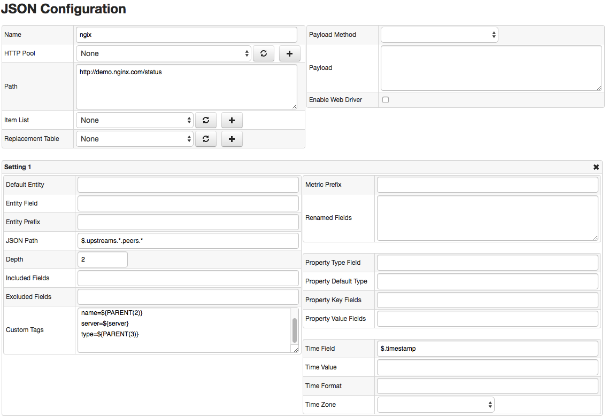

# JSON Job

## Overview

The JSON job provides a way to download JSON files from remote systems or read files from the local file system, to convert the files into series, properties, and message commands sent into the the Axibase Time Series Database.

## Workflow

### File downloaded via HTTP

1. Download the target JSON file from a remote server.
2. Parse the file into memory as a JSON document.
3. Select objects from the JSON document with the specified JSON Path expression.
4. Build a series, property, or message command from the object's fields.
5. Each matched object is translated into a separate set of commands.
6. Repeat Steps 3-5 for each configuration setting/JSON expression.
7. Send commands into Axibase Time Series Database.

### File on Local File System

1. Locate one or multiple files at the specified path on the local file system.
2. Parse the file into memory as a JSON document.
3. Select objects from the JSON document with the specified JSON Path expression.
4. Build a series, property, or message command from the object's fields.
5. Each matched object is translated into a separate set of commands.
6. Repeat Steps 3-5 for each configuration setting/JSON expression.
7. Send commands into Axibase Time Series Database.
8. If `Delete on Upload` setting is enabled and commands were accepted by ATSD, **delete** the source file.
9. Repeat Steps 2-8 for each matched file.

## JSON Path

The [JSON path](https://github.com/jayway/JsonPath#operators) is an expression evaluated against the JSON document to select its objects or specific fields.

* The expression starts with `$` representing the root object followed by dot-separated path to matched objects. 
* `.{cname}` denotes a selector of the given object's child object with name `cname`.
* `{arr-name}[*]` stands for all elements of the specified array `arr-name`.

Example:

```json
$.store.book[*]
```

The expression will select all elements of the `book` array in the root's child named `store`. 

```json
{
	"store": {
		"book": [{
			"category": "reference",
			"author": "Nigel Rees",
			"title": "Sayings of the Century",
			"price": 8.95
		}, {
			"category": "fiction",
			"author": "Evelyn Waugh",
			"title": "Sword of Honour",
			"price": 12.99
		}]
	}
}
```

## Download Settings

| **Name** | **Description** |
|:---|:---|
| Protocol | HTTP or File protocol to download JSON files from a remote server or read them from the local file system. File protocol supports wildcards in Path. |
| HTTP Pool                | Pre-defined HTTP connection parameters to limit the number of open connections, to customize timeout settings, and to re-use connections across multiple requests.<br> When HTTP Pool is selected, the Path field should contain relative URI: [/]path[?query][#fragment] |
| Path                     | URI Path to JSON file, for example https://example.com/api/daily-summary.json, or absolute path to the file(s) on the local file system.<br> If HTTP Pool is enabled, the path should be relative, for example /api/daily-summary.json. Otherwise the Path should be a full URI including protocol, host, port, and the path.<br> The Path supports the following placeholders:<br> - ${ITEM} current element in the Item List<br> - ${TIME()} text output of the TIME function<br> - ${DATE_ITEM()} text output of the DATE_ITEM function.<br><br> If ${DATE_ITEM()} is present in Path, the job will execute as many queries as there are elements returned by ${DATE_ITEM()} function, substituting ${DATE_ITEM()} placeholder with the element value for each request.<br> The Path can include either ${DATE_ITEM()} or ${ITEM} function, but not both. |
| Format                   | JSON, JSON Lines or SODA Rows. If `JSON Lines` format is selected, the input lines contained in the file will be added to a parent array object and processed as a single JSON document. |
| Item List                | A collection of elements to execute multiple requests for different JSON files in a loop.<br> The current element in the loop can be accessed with ${ITEM} placeholder which can be embedded into Path and Default Entity fields.<br> When Item List is selected and ${ITEM} is present in Path, the job will execute as many queries as there are elements in the list, substituting ${ITEM} with element value for each request. |
| Replacement Table        | A set of mappings for converting entity names retrieved from the JSON document into entity names to be stored in the database. |
| HTTP Method              | HTTP Method executed: GET or POST. POST method provides a way to specify request parameters in payload. |
| Payload                  | POST request payload. |
| HTTP Headers             | Specify request headers. |
| Enable Web Driver        | When enabled, executes Driver Script. |
| Driver Script*           | Downloads the file by executing a set of pre-recorded browser actions such as opening a page and clicking on button to export a file.<br> The script is recorded in Selenium IDE and exported into Java format. |
| Driver Timeout, seconds* | Maximum time allowed for the Driver Script to run before it will be aborted. |
| Driver File Encoding*    | File Encoding to use when saving a file downloaded with Driver Script. |
| Delete Files on Upload   | _Applies to FILE protocol._ Delete source file(s) that were parsed into at least 1 command which was successfully sent to the database. |

## Conversion Settings

### JSON Fields

| **Name** | **Description** |
|:---|:---|
| JSON Path       | JSON Path expression to match an object or a list of objects in the JSON document. Default path is $ which stands the root object.<br> JSON Path supports the following placeholders:<br> - ${ITEM} current element in the Item List<br> - ${TIME()} text output of the TIME function<br> - ${DATE_ITEM()} text output of the DATE_ITEM function.<br><br> If ${DATE_ITEM()} is present in JSON Path, the JSON Path expression will return a combined list of objects that matched any of the elements returned by ${DATE_ITEM()} function. |
| Traversal Depth | Maximum traversal limit measured as the difference between the matched object and nested objects. When Depth is set to 1, the collector will include only direct fields of the matched object. If Depth is set to 0 or negative number, all nested objects will be traversed and included into commands. |
| Renamed Fields  | Pairs of oldname=newname mappings, one per line, to rename fields in the matched object. |
| Custom Tags     | Additional series, property, and message tags. Supported placeholders:<br> - ${HOST} - Hostname from which the JSON document was loaded.<br> - ${PARENT(n)} - Name of the Nth parent of the matched object. {PARENT} is a shortcut for ${PARENT(1)}<br> - ${field_name} - Value of the specified filed in the matched object. |

### Entity Fields

| **Name** | **Description** |
|:---|:---|
| Default Entity | Entity that will be used in all commands ([example](#default-entity)).<br> This field  supports the following options:<br> - Text value<br> - ${HOST} placeholder - Hostname from which the JSON document was loaded.<br> - ${ITEM} placeholder - Current element in the Item List.<br> - ${PARENT(n)} placeholder - Name of the Nth parent of the matched object. {PARENT} is a shortcut for ${PARENT(1)}.|
| Entity Field   | Value that will be used as entity in all commands ([example](#entity-field)).<br> This field supports the following options:<br> - Name of the field containing entity in the matched object<br> - JSON Path | 
| Entity Prefix  | Text added to entity name extracted retrieved from the specified field ([example](#entity-field)).<br> For example, if Entity Prefix is set to 'custom.', and the field value is 'my-host', the resulting entity name will be 'custom.my-host'. |

### Series Fields

| **Name** | **Description** |
|:---|:---|
| Metric Prefix      | Text added to metric name.<br> For example, if Metric Prefix is set to 'custom.', and the metric name is 'cpu_busy', the resulting metric name will be 'custom.cpu_busy'. |
| Included Fields    | Specify fields that should be included into the Series command ([example](#included-fields)). If you leave the field empty, all values will be included into the command. You can use the '.' symbol for nested fields. Wildcard '*' is supported. |
| Excluded Fields    | Specify fields that should be excluded from the Series command ([example](#excluded-fields)). You can use the '.' symbol for nested fields. Wildcard '*' is supported. |
| Metric Name Field  | Metric name extracted from the given field in the matched object([example](#metric-name-and-value-fields)). |
| Metric Value Field | Metric value extracted from the given field in the matched object([example](#metric-name-and-value-fields)). |

### Property Fields

| **Name** | **Description** |
|:---|:---|
| Property Default Type | Property type that will be used as a default type for all properties ([example](#property-default-type)).<br> This field supports the following options:<br> - Text value<br> - ${ITEM} placeholder - Current element in the Item List.<br> - ${PARENT(n)} placeholder - Name of the Nth parent of the matched object. {PARENT} is a shortcut for ${PARENT(1)}. |
| Property Type Field   | Field with value that will be used as property type ([example](#property-type-field)).<br> This field supports the following options:<br> - Name of the field containing property type in the matched object<br> - JSON Path |
| Property Key Fields   | Fields that should be included into the Property command value collection ([example](#property-key-and-value-fields)). |
| Property Value Fields | Fields that should be loaded to a collection as properties ([example](#property-key-and-value-fields)). |

### Time Fields

| **Name** | **Description** |
|:---|:---|
| Time Default | Specify time value for all commands ([example](#time-default)).<br> This field supports the following options:<br> - ${TIME()} text output of the TIME function<br> - ${ITEM} placeholder - Current element in the Item List.<br> - ${PARENT(n)} - Name of the Nth parent of the matched object. {PARENT} is a shortcut for ${PARENT(1)}.<br> Field supports additional placeholders, if `FILE` protocol is selected:<br>- ${FILE} - Name of the file<br>- ${DIRECTORY} - Parent directory of file<br>- ${PATH} - Full path to file<br> |
| Time Field   | Field with values that specify time for all commands ([example](#time-field)).<br> This field supports the following options:<br> - Name of the field containing date in the matched object<br> - JSON Path |
| Time Format  | Date format applied when parsing time value ([example](#metric-name-and-value-fields)). |
| Time Zone    | Time zone can be optionally applied if the extracted date is in local time, otherwise local Collector time zone is in effect ([example](#time-field)). |

### Message Fields

| **Name** | **Description** |
|:---|:---|
| Message Default Type | Message type that will be used as a default type for all messages ([example](#message-defaults)).<br> This field supports the following options:<br> - Text value<br> - ${ITEM} placeholder - Current element in the Item List.<br> - ${PARENT(n)} placeholder - Name of the Nth parent of the matched object. {PARENT} is a shortcut for ${PARENT(1)}.<br> Field supports additional placeholders, if `FILE` protocol is selected:<br>- ${FILE} - Name of the file<br>- ${DIRECTORY} - Parent directory of file<br>- ${PATH} - Full path to file<br> |
| Message Type Field   | Field with value that will be used as message type ([example](#message-fields)).<br> This field supports the following options:<br> - Name of the field containing message type in the matched object<br> - JSON Path |
| Message Default Type | Message source that will be used as a default source for all messages ([example](#message-defaults)).<br> This field supports the following options:<br> - Text value<br> - ${ITEM} placeholder - Current element in the Item List.<br> - ${PARENT(n)} placeholder - Name of the Nth parent of the matched object. {PARENT} is a shortcut for ${PARENT(1)}.<br> Field supports additional placeholders, if `FILE` protocol is selected:<br>- ${FILE} - Name of the file<br>- ${DIRECTORY} - Parent directory of file<br>- ${PATH} - Full path to file<br> |
| Message Type Field   | Field with value that will be used as message source ([example](#message-fields)).<br> This field supports the following options:<br> - Name of the field containing message source in the matched object<br> - JSON Path |
| Message Tag Fields   | Message tags, included as tags into message command ([example](#message-fields)). |
| Message Default | Message value that will be used as a default text for all messages ([example](#message-defaults)).<br> This field supports the following options:<br> - Text value<br> - ${ITEM} placeholder - Current element in the Item List.<br> - ${PARENT(n)} placeholder - Name of the Nth parent of the matched object. {PARENT} is a shortcut for ${PARENT(1)}.<br> Field supports additional placeholders, if `FILE` protocol is selected:<br>- ${FILE} - Name of the file<br>- ${DIRECTORY} - Parent directory of file<br>- ${PATH} - Full path to file<br> |
| Message Field   | Field with value that will be used as message text ([example](#message-fields)).<br> This field supports the following options:<br> - Name of the field containing message source in the matched object<br> - JSON Path |

## Placeholders

| **Name** | **Description** |
|:---|:---|
| `${ITEM}` | Current element in the Item List.|
| `${TIME()}` | Text output of the `TIME` function. |
| `${DATE_ITEM()}` | Current element in the Date Item List.|
| `${HOST}` | Host name |
| `${PARENT}` | Shortcut for ${PARENT(1)} |
| `${PARENT(n)}` | Parent name from Json Path of matched object. |
| `${PATH}` | File's absolute path. |
| `${FILE}` | File's name. |
| `${DIRECTORY}` | File's parent directory. |

## Examples

* [Australia Bureau of Meteorology Weather](examples/json/australia-weather/README.md#overview)
* [JSON Lines](examples/json/json_lines/README.md#overview)
* [GitHub Daily Summary](examples/json/github-daily-summary/README.md#overview)
* [Nginx Status](examples/json/nginx-status/README.md#overview)

## Additional Examples

- [Json Fields](#json-fields-examples)
  - [Custom Tags](#custom-tags)
- [Entity Fields](#entity-fields-examples)
  - [Default Entity](#default-entity)
  - [Entity Field](#entity-field)
- [Series Fields](#series-fields-examples)
  - [Metric Prefix](#metric-prefix)
  - [Included Fields](#included-fields)
  - [Excluded Fields](#excluded-fields)
  - [Metric Name and Value Fields](#metric-name-and-value-fields)
- [Property Fields](#property-fields-examples)
  - [Property Default Type](#property-default-type)
  - [Property Type Field](#property-type-field)
  - [Property Key and Value Fields](#property-key-and-value-fields)
- [Time Fields](#time-fields-examples)
  - [Time Default](#time-default)
  - [Time Field](#time-field)
- [Message Fields](#message-fields-examples)
  - [Message Defaults](#message-defaults)
  - [Message Fields](#message-fields)

### Json Fields Examples

#### Custom tags

JSON:

```json
{
  "upstreams": {
    "demo-backend": {
      "peers": [
        {
          "active": 0,
          "responses": {
            "1xx": 0,
            "total": 0
          },
          "id": 1,
          "server": "1.2.3.4:1234"
        }
      ]
    }
  }
}
```

Field Name      | Field Value
:-------------- | :----------
Default Entity  | tst
JSON Path       | $.upstreams.demo-backend.peers.*
Depth           | 2
**Custom Tags** | **server=${server}<br>name=${PARENT(2)}<br>type=${PARENT(3)}.${PARENT}**

Result:

```ls
series e:tst d:2016-07-07T15:22:59.593Z t:name=demo-backend t:server=1.2.3.4:1234 t:type=upstreams.peers m:id=1 m:active=0 m:responses.total=0 m:responses.1xx=0
```

### Entity Fields Examples

#### Default Entity

JSON:

```json
{
  "upstreams": {
    "demo-backend": {
      "peers": [
        {
          "active": 0,
          "responses": {
            "1xx": 0,
            "total": 0
          },
          "id": 1,
          "server": "1.2.3.4:1234"
        }
      ]
    }
  }
}
```

- Default Entity contains placeholder ${HOST)}:

  Field Name         | Field Value
  :----------------- | :----------
  Path               | http://example.com
  **Default Entity** | **${HOST}**
  JSON Path          | $.upstreams.demo-backend.peers.*
  Depth              | 2

  Result:

  ```ls
  series e:example.com d:2016-07-07T15:19:01.365Z m:id=1 m:active=0 m:responses.total=0 m:responses.1xx=0
  ```
  
- Default Entity contains placeholder ${PARENT(n)}:

  Field Name         | Field Value
  :----------------- | :----------
  Path               | http://example.com
  **Default Entity** | **${PARENT(2)}**
  JSON Path          | $.upstreams.demo-backend.peers.*
  Depth              | 2

  Result:

  ```ls
  series e:demo-backend d:2016-07-07T15:19:34.924Z m:id=1 m:active=0 m:responses.total=0 m:responses.1xx=0
  ```
  
- Default Entity contains text:

  Field Name         | Field Value
  :----------------- | :----------
  Path               | http://example.com
  **Default Entity** | **tst**
  JSON Path          | $.upstreams.demo-backend.peers.*
  Depth              | 2

  Result:

  ```ls
  series e:tst d:2016-07-07T15:19:34.924Z m:id=1 m:active=0 m:responses.total=0 m:responses.1xx=0
  ```

#### Entity Field

JSON:

```json
{
  "upstreams": {
    "demo-backend": {
      "peers": [
        {
          "active": 0,
          "responses": {
            "1xx": 0,
            "total": 0
          },
          "id": 1,
          "server": "1.2.3.4:1234",
          "type": "peer"
        }
      ]
    }
  }
}
```

Field Name       | Field Value
:--------------- | :----------
Path             | http://example.com
**Entity Field** | **type**
Entity Prefix    | tst.
JSON Path        | $.upstreams.demo-backend.peers.*
Depth            | 1

Result:

```ls
series e:tst.peer d:2016-07-06T08:14:42.540Z m:id=1 m:active=0
```

### Series Fields Examples

#### Metric Prefix

JSON:

```json
{
  "has_more": false, 
  "items": [
    {
      "count": 878240,
      "name": "java"
    }
  ], 
  "quota_max": 10000, 
  "quota_remaining": 9923
}
```

Field Name        | Field Value
:---------------- | :----------
Default Entity    | tst
JSON Path         | $
Depth             | 0
**Metric Prefix** | **mp.**

Result:

```ls
series e:tst d:2016-07-06T07:27:48.184Z m:mp.quota_max=10000 m:mp.items.0.count=878240 m:mp.quota_remaining=9923 
```

#### Included Fields

JSON:

```json
{
  "has_more": false, 
  "items": [
    {
      "count": 878240,
      "name": "java"
    }
  ], 
  "quota_max": 10000, 
  "quota_remaining": 9923
}
```

Field Name          | Field Value
:------------------ | :----------
Default Entity      | tst
JSON Path           | $
Depth               | 1
**Included Fields** | **quota_remaining,has_more**

Result:

```ls
series e:tst d:2016-07-06T07:14:42.540Z t:has_more=false m:quota_remaining=9923
```

#### Excluded Fields

JSON:

```json
{
  "has_more": false, 
  "items": [
    {
      "count": 878240,
      "name": "java"
    }
  ], 
  "quota_max": 10000, 
  "quota_remaining": 9923
}
```

Field Name          | Field Value
:------------------ | :----------
Default Entity      | tst
JSON Path           | $
Depth               | 0
**Excluded Fields** | **quota_remaining**

Result:

```ls
series e:tst d:2016-07-06T07:27:48.184Z m:quota_max=10000 m:items.0.count=878240
```

#### Metric Name and Value Fields

JSON Lines:

```json
[{"data":[{"pitagname":"metric1","pitagvalue":350.0,"timestamp":"2016-07-01T15:59:07.6382972+05:30"}]}]
[{"data":[{"pitagname":"metric2","pitagvalue":250.0,"timestamp":"2016-07-01T15:58:07.6382972+05:30"}]}]
```

Field Name             | Field Value
:--------------------- | :----------
Default Entity         | tst
JSON Path              | $..data.*
Depth                  | 1
Time Field             | timestamp
Time Format            | yyyy-MM-dd'T'HH:mm:ss.SSSSSSSZ
Excluded Fields        | pitagvalue
**Metric Name Field**  | **pitagname**
**Metric Value Field** | **pitagvalue**

Result:

```ls
series e:tst d:2016-07-01T10:29:07.638Z m:metric1=350
series e:tst d:2016-07-01T10:28:07.638Z m:metric2=250
```

### Property Fields Examples

#### Property Default Type

JSON:

```json
{
  "upstreams": {
    "demo-backend": {
      "peers": [
        {
          "active": 0,
          "responses": {
            "1xx": 0,
            "total": 0
          },
          "id": 1,
          "server": "1.2.3.4:1234"
        }
      ]
    }
  }
}
```

Field Name                | Field Value
:------------------------ | :----------
Default Entity            | tst
JSON Path                 | $.upstreams.*.peers.*
Depth                     | 1
**Property Default Type** | **${PARENT(3)}.${PARENT}**

Result:

```ls
property t:upstreams.peers e:tst d:2016-07-06T07:42:46.824Z v:state=up v:server=10.0.0.2:15431 v:backup=false
```

#### Property Type Field

JSON:

```json
{
  "has_more": false, 
  "items": [
    {
      "count": 878240,
      "name": "java"
    }
  ], 
  "quota_max": 10000, 
  "quota_remaining": 9923,
  "type": "type1"
}
```

Field Name                | Field Value
:------------------------ | :----------
Default Entity            | tst
JSON Path                 | $
Depth                     | 0
**Property Type Field**   | **type**

Result:

```ls
property t:type1 e:tst d:2016-07-06T07:46:58.874Z v:type=type1 v:items.0.name=java v:has_more=false
```

#### Property Key and Value Fields

JSON:

```json
{
  "has_more": false, 
  "items": [
    {
      "count": 878240,
      "name": "java"
    }
  ], 
  "quota_max": 10000, 
  "quota_remaining": 9923,
  "type": "type1"
}
```

Field Name                | Field Value
:------------------------ | :----------
Default Entity            | tst
JSON Path                 | $
Depth                     | 0
Property Type Field       | type
**Property Key Fields**   | **name**
**Property Value Fields** | **quota_max,has_more**

Result:

```ls
property t:type1 e:tst d:2016-07-06T07:46:58.874Z k:name=java v:quota_max=100000 v:has_more=false
```

### Time Fields Examples

#### Time Field

JSON:

```json
{
  "data": [
    {
      "date": "2016-01-01",
      "ok": 10,
      "fail": 2
    },
    {
      "date": "2016-01-02",
      "ok": 15,
      "fail": 2
    }
  ]
}
```

Field Name     | Field Value
:------------- | :----------
Default Entity | tst
JSON Path      | $.data.*
**Time Field** | **date**
Time Format    | yyyy-MM-dd
Time Zone      | UTC

Result:

```ls
series e:tst d:2016-01-01T00:00:00.000Z m:fail=2 m:ok=10
series e:tst d:2016-01-02T00:00:00.000Z m:fail=2 m:ok=15
```

#### Time Default

JSON:

```json
{
  "2016-01-01": {
    "ok": 10,
    "fail": 2
  },
  "2016-01-02": {
    "ok": 15,
    "fail": 2
  }
}
```

Field Name       | Field Value
:--------------- | :----------
Default Entity   | tst
JSON Path        | $.*
**Time Default** | **${PARENT}**
Time Format      | yyyy-MM-dd
Time Zone        | UTC

Result:

```ls
series e:tst d:2016-01-01T00:00:00.000Z m:fail=2 m:ok=10
series e:tst d:2016-01-02T00:00:00.000Z m:fail=2 m:ok=15
```

### Message Fields Examples

#### Message Defaults

- Defaults contain placeholders:

  JSON:

  ```json
  {
    "upstreams": {
      "demo-backend": {
        "peers": [
          {
            "active": 0,
            "responses": {
              "1xx": 0,
              "total": 0
            },
            "id": 1,
            "server": "1.2.3.4:1234"
          }
        ]
      }
    }
  }
  ```

  Field Name                  | Field Value
  :-------------------------- | :----------
  Default Entity              | tst
  JSON Path                   | $.upstreams.*.peers.*
  Depth                       | 1
  **Message Default Type**    | **${PARENT(3)}.${PARENT}**
  **Message Default Source**  | **${PARENT(2)}**
  **Message Default**         | **${PARENT(1)}**

  Result:

  ```ls
  message e:tst d:2016-07-06T08:19:30.563Z t:source=demo-backend t:type=upstreams.peers m:peers
  ```

- Defaults contain text:

  JSON:

  ```json
  {
    "upstreams": {
      "demo-backend": {
        "peers": [
          {
            "active": 0,
            "responses": {
              "1xx": 0,
              "total": 0
            },
            "id": 1,
            "server": "1.2.3.4:1234"
          }
        ]
      }
    }
  }
  ```

  Field Name                  | Field Value
  :-------------------------- | :----------
  Default Entity              | tst
  JSON Path                   | $.upstreams.*.peers.*
  Depth                       | 1
  **Message Default Type**    | **upstream**
  **Message Default Source**  | **demo**
  **Message Default**         | **test**

  Result:

  ```ls
  message e:tst d:2016-07-06T08:19:30.563Z t:source=demo t:type=upstream m:test
  ```

#### Message Fields

JSON:

```json
{
  "upstreams": {
    "demo-backend": {
      "peers": [
        {
          "active": 0,
          "responses": {
            "1xx": 0,
            "total": 0
          },
          "id": 1,
          "server": "1.2.3.4:1234",
          "type": "peer"
        }
      ]
    }
  }
}
```

Field Nam                | Field Value
:----------------------- | :----------
Default Entity           | tst
JSON Path                | $.upstreams.*.peers.*
Depth                    | 1
**Message Type Field**   | **type**
**Message Source Field** | **server**
**Message Field**        |
Message Default          |
**Message Tag Fields**   | **id**

Result:

```ls
message e:tst d:2016-07-06T08:19:30.563Z t:id=1 t:source=1.2.3.4:1234 t:type=peer m:""
```

## Configuration Example



## JSON viewer Example


