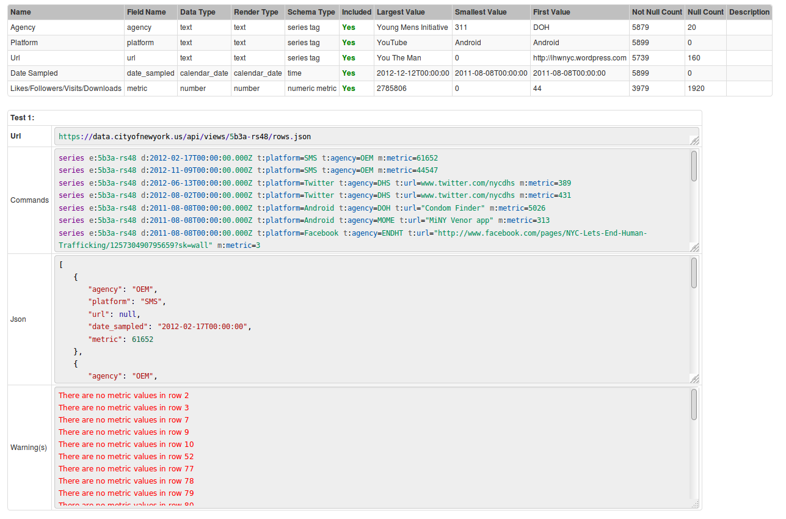

# Socrata Job Tutorial

In this tutorial we will walk through setting up a Socrata job in Collector for a data.gov dataset on [New York City Social Media Usage](https://catalog.data.gov/dataset/nyc-social-media-usage-555a2).
The JSON file (1.1 MB) can be found [here](https://data.cityofnewyork.us/api/views/5b3a-rs48/rows.json?accessType=DOWNLOAD).

1. Login into Collector.

   

2. Click on the 'Jobs' tab in Collector.

   

3. Click on the `Add Job` button.

   

4. To select the type of job you would like to add, you may complete either of the following steps.

   - Before completing the previous step, filter by your desired job type (Socrata) in the 'Jobs' tab. After pressing the `Add Job` button, the desired job type will have already been specified.
	
   

   - Press the `Add Job` button (step 3). On the following page, select your specified job type.
	
   

5. As shown in the image below, there are four fields to specify: `Enabled`, `Name`, `Cron Expression`, and `Storage`.

   

   - `Enabled`: job status. You may enable the job, which will turn it on for data collection, by clicking the check box. To have the job disabled, leave it unchecked. 
	  Leave unchecked this for tutorial. 
   - `Name`: job name. Enter in a relevant name for your new Socrata job. Let's use the name `NYC-Social-Media-Usage`.
   - `Cron Expression`: job execution time period. Cron fields are specified in the following order: second, minute, hour, day-of-month, month, and day-of-week. You can randomize time of execution by putting `R` onto time placeholders. Click 
	  on field to see time periods in human readable formats, as shown in the image below. 
   - `Storage`: database for storing data collected by this job. 
	  
   
	
6. After specifying each of these fields, hit the `Save` button.
7. Press the `Create Configuration` button.

   

8. Copy the short URL (**without** `rows.json?accessType=DOWNLOAD` selected) from your JSON file and paste it into the `Path` line. You do not need to fill in the `Name` field, as 
   it will be automatically filled in from the previous page. For more information on the remaining fields in this screenshot, click [here](https://github.com/axibase/axibase-collector-docs/blob/master/jobs/socrata.md#job-configuration).
   
   
   
9. Press `Add`.
10. Press `Test`. To view descriptions of each of the fields show below, click [here](https://github.com/axibase/axibase-collector-docs/blob/collector-updates/jobs/socrata-tutorial.md). 

    

11. After pressing the `Test` button, you should get the following output. We have downloaded a part of the JSON file (file limitation 1 Mb) and generated commands based off of 
    the dataset configuration (series, property, message, metric, and entity tags). You may now save this configuration (by clicking the `Save` button shown in the image from
    step 10), and run this job in ATSD to begin working with this dataset.

    
