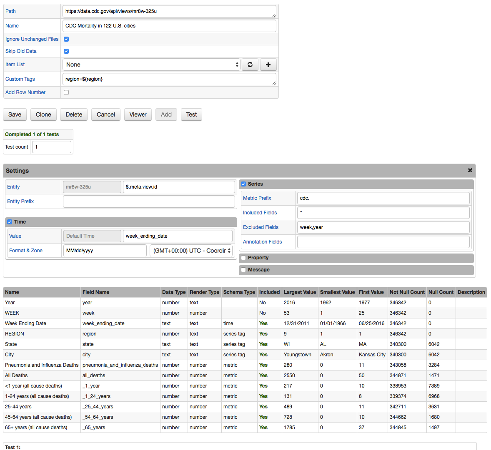

# Socrata Job

## Overview

The Socrata job provides a way to convert JSON documents published in [Open Data](https://project-open-data.cio.gov/v1.1/schema/) schema into series, property, and message commands.

Unlike the generic [JSON job](/jobs/json.md), the Socrata job simplifies the processing using built-in rules and heuristics, eliminating the need to use JSONPath expressions to map JSON fields to command fields.

JSON documents published in the Open Data format contain both metadata as well as data itself.

* Metadata: https://data.cdc.gov/api/views/mr8w-325u
* Metadata and data: https://data.cdc.gov/api/views/mr8w-325u/rows.json

The most important part that the Socrata job relies on for processing is the `columns` section in the metadata, which provides a list of column names, their datatypes, and typical values.

```json
"columns" : [ {
    "id" : 272239777,
    "name" : "Year",
    "dataTypeName" : "text",
    "fieldName" : "year",
    "position" : 2,
    "renderTypeName" : "text",
    "tableColumnId" : 38857128,
    "width" : 148,
    ,,,
}]
```

## Job Settings

The [settings](/job-generic.md) implemented at the job level are the same as for other job types.
The ['Cron Schedule'](/scheduling.md) defines how often the dataset should be checked for new records and ['Storage'](/atsd-server-connection.md) determines the target ATSD instance where the commands should be sent.

If the source dataset is static and will not be updated, it may not make sense to enable the job since the data will always be the same. To load data once for a static dataset, save the job and click on the 'Run' button/link to execute the job manually. If, however, the underlying dataset is regularly updated with new rows, enabling the job and specifying an appropriate schedule ensures that new data is continuously propagated into ATSD.

Each Socrata job can have multiple configurations, with each loading data for a different dataset. The configurations will be executed sequentially, when the job is launched, and will send the data into the same ATSD instance. It is recommended that datasets with similar update intervals are grouped under one job for efficient processing. For example, datasets that are updated weekly can be grouped into one 'Weekly Socrata' job.

#### Job Configuration

The configuration instructs Collector how to convert fields in the JSON document into series, property, and message commands.

> To automatically map JSON columns to command fields, enter dataset URL into the Path field and click [Add].

| **Field** | **Description**  |
| :---- |:--- |
| Path | Full URL to the dataset including the protocol, host, port, path, and optional query string.<br>Example: 	https://data.cityofnewyork.us/api/views/f9bf-2cp4/rows.json or	https://data.cityofnewyork.us/api/views/f9bf-2cp4. The URL is typically available in the dataset [catalogs](https://catalog.data.gov/dataset/deaths-in-122-u-s-cities-1962-2016-122-cities-mortality-reporting-system) as 'Unique Identifier' under the 'Additional Metadata' section.|
| Name | Configuration Name. You can complete this field manually. Otherwise, it will be automatically filled in from the 'Name' field from when you initially created the job.|
| Ignore Unchanged Files | Prevents unchanged http entities from being repeatedly processed. When enabled, Collector compares the "Last-Modified" header/MD5 hashcode (HTTP, HTTP_POOL) with the previously stored value and ignores it if there are no changes.|
| Skip Old Data | Ignore re-sending previously sent data when an updated dataset file is being processed.|
| Item List | A collection of elements to execute multiple requests for different SOCRATA files in a loop. The current element in the loop can be accessed with the `${ITEM}` placeholder, which can be embedded into the Path and Default Entity fields.|
| Custom Tags | Additional series, property, and message tags, specified as name=value, one tag per line. Examples: `region=${region}`, `class=${graduating_class}` |
| Add Row Number | An extra metric with name `{prefix}row_number` added to series commands in case the data row doesn't contain any numeric columns.|
| Entity | Entity name, specified literally or extracted from the specific field in the matched object (usually `$.meta.view.id`).|
| Entity Prefix | Text added to the entity name, retrieved from the specified field. For example, if Entity Prefix is set to 'custom.', and the field value is 'my-host', the resulting entity name will be 'custom.my-host'.|
| Metric Prefix | Text added to the metric name. For example, if Metric Prefix is set to 'custom.', and the metric name is 'cpu_busy', the resulting metric name will be 'custom.cpu_busy'.|
| Included Fields | By default, all numeric fields from nested objects are included in commands. The list of included fields can be overridden explicitly by specifying their names, separated by comma.|
| Excluded Fields | List of particular field names to be excluded from commands. Applies when 'Included Fields' is empty.|
| Annotation Fields | List of fields whose values will be saved as 'text' annotation along with the numeric value.|
   
### Configuration Example



* Dataset URL: https://data.cdc.gov/api/views/mr8w-325u
* Sample Command:

```ls
series e:mr8w-325u d:1962-01-06T00:00:00.000Z t:region=1 t:state=MA t:city=Boston m:cdc._54_64_years=87 m:cdc._1_year=10 m:cdc.all_deaths=262 m:cdc._25_44_years=11 m:cdc._65_years=146 m:cdc.pneumonia_and_influenza_deaths=11 m:cdc._1_24_years=8
```
